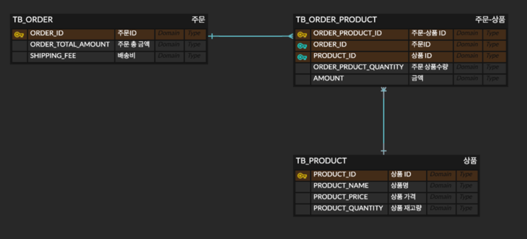

# 29cm homework - 상품 주문 프로그램

## - 프로젝트 구조
```
├── command
│   ├── dto
│   │   ├── InitialCommand.class
│   │   └── OrderCommand.class
│   ├── enums
│   │   └── InitialCommandEnum.class
│   └── service
│       └── CommandService.class
├── global
│   ├── exception
│   │   ├── InvalidCommandException.class
│   │   ├── NoSuchDataException.class
│   │   └── SoldOutException.class
│   └── formatter
│       └── MoneyFormatter.class
├── order
│   ├── dto
│   │   ├── CreateOrderDTO$CreateOrderDTOBuilder.class
│   │   ├── CreateOrderDTO.class
│   │   ├── CreateOrderProductDTO$CreateOrderProductDTOBuilder.class
│   │   ├── CreateOrderProductDTO.class
│   │   ├── OrderDTO$OrderDTOBuilder.class
│   │   ├── OrderDTO.class
│   │   ├── OrderProductDTO$OrderProductDTOBuilder.class
│   │   ├── OrderProductDTO.class
│   │   ├── RequestOrderProductDTO$RequestOrderProductDTOBuilder.class
│   │   └── RequestOrderProductDTO.class
│   ├── entity
│   │   ├── OrderEntity$OrderEntityBuilder.class
│   │   ├── OrderEntity.class
│   │   ├── OrderProductEntity$OrderProductEntityBuilder.class
│   │   └── OrderProductEntity.class
│   ├── repository
│   │   ├── OrderProductRepository.class
│   │   └── OrderRepository.class
│   └── service
│       ├── OrderProductService.class
│       └── OrderService.class
└── product
    ├── dto
    │   ├── ProductDTO$ProductDTOBuilder.class
    │   └── ProductDTO.class
    ├── entity
    │   └── ProductEntity.class
    ├── repository
    │   └── ProductRepository.class
    └── service
        └── ProductService.class
```

- command: 커맨드형 프로그램을 위한 입출력 패키지
- global: exception, formatter 와 같은 프로젝트 전역적인 로직을 담당하는 패키지
- order: 주문 로직 관련 패키지
- product: 상품 로직 관련 패키지

## - 데이터베이스
```
H2 in-memory database를 사용했으며, data.sql을 정의해 데이터를 로드하는 방식 
```

## - 모델링

